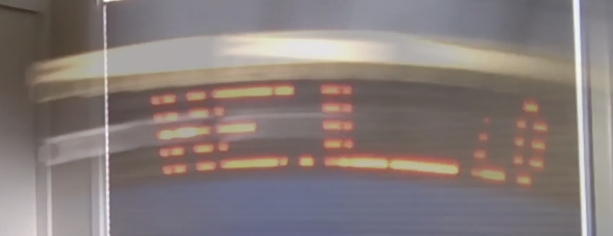
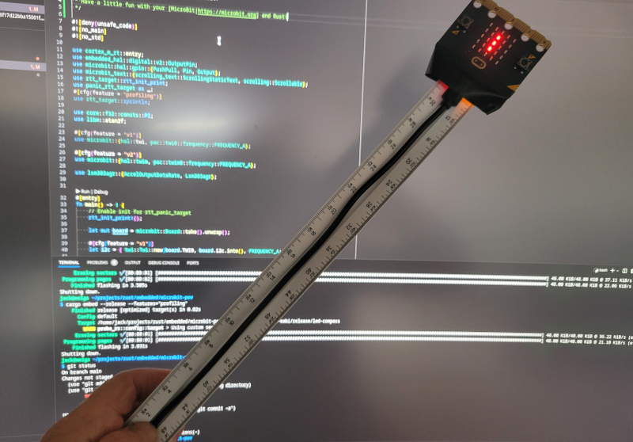

 # "Persistence of Vision" demo on the MicroBit

 

What geek doesn't love blinky lights? Here is a fun little hack in Rust
on the [MicroBit|https://microbit.org] nRF52 based board that demonstrates the classic 
["Persistence of Vision"|https://en.wikipedia.org/wiki/Persistence_of_vision] effect. 
Here we use the MicroBit's accelerometer and LED array to display the message "Hello"
as the board is rotated. The code is derived from the excellent [Rust Embedded Discovery 
Book|https://docs.rust-embedded.org/discovery/microbit] examples. It works best if you fix
the board to a stick, I used a ruler. As you sweep the board in arc the magic appears
as shown in the picture above.

Here is my setup:
 

Here is just the blinky lights up close:

